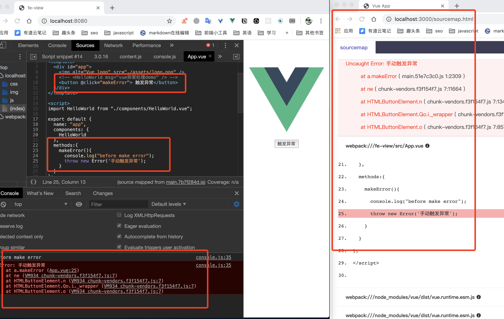

<!--
 * @Author: hucheng
 * @Date: 2020-04-28 00:15:39
 * @Description: here is des
 -->
# vue source-map demo

实际效果

# dev

- npm i
- npm run build
- cd fe-view/dist  && http-server -p 80808 or live-server -p 8080 ( or other static server,if not http-server, you need npm i http-server -g or npm i -g live-server)
- npm run dev 
- open http://localhost:8080/,
- open http://localhost:3000/sourcemap.html 